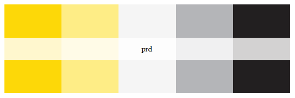

# `mexicolors`: A Mexican politics-inspired color palette generator

Building on Philip Waggoner's approach to designing color palettes in the `amerika` package, the `mexicolors` package offers a variety of a Mexican politics-inspired color palettes for a host of applications both in and out of politics. 

Palette options range from only a few colors to several colors, but with discrete and continuous options to offer greatest flexibility to the user. `mexicolors` allows for a range of applications, from mapping brief discrete scales to continuous interpolated arrays including dozens of shades graded from green to red. See below for a list of the palettes followed by a few political and non-political examples.

## Installation

 Dev:

```{r }
devtools::install_github("alexplatasl/mexicolors")
library(mexicolors)
```

CRAN:

```{r }
install.packages("mexicolors")
library(mexicolors)
```

## Use

Users simply supply the name of the desired palette in the main function `mexico_palette()`, along with the number `n` of colors desired from the palette (e.g., only 4 from a 5-color palette), and whether "continuous" or "discrete" `type` mapping is desired. Semi-transparent colors are supported with `alpha` argument.

## Palettes 

1. `morena`: two shades of red and two shades of grey.
2. `pri`: four colors including green, white, grey, and red.
3. `pan`: four colors including three shades of blue and one shade of white.
4. `prd`: five colors including two shades of yellow, one shade of white, and two shades of grey.
5. `cuatroT`: eight colors including two shades of red, two shades of yellow, two shades of gray, and two shades of green.
6. `ine`: four colors including whine, mexican pink, grey, and black.
7. `pvem`: six colors including three shades of green, yellow, red, and black.
8. `mc`: eight colors including four shades of orange and four shades of gray..

### Displaying each palette

```{r }
mexico_palette("cuatroT", display = TRUE)
```


```{r }
mexico_palette("ine", display = TRUE)
```


```{r }
mexico_palette("morena", display = TRUE)
```


```{r }
mexico_palette("pri", display = TRUE)
```


```{r }
mexico_palette("pan", display = TRUE)
```


```{r }
mexico_palette("prd", display = TRUE)
```



```{r }
mexico_palette("pvem", display = TRUE)
```


```{r }
mexico_palette("mc", display = TRUE)
```


### Interpolating between existing colors based on the palettes using the "continuous" `type`

```{r }
mexico_palette(n = 50, name = "cuatroT", type = "continuous", display = TRUE)
```


```{r }
mexico_palette(n = 50, name = "ine", type = "continuous", display = TRUE)
```


```{r }
mexico_palette(n = 50, name = "morena", type = "continuous", display = TRUE)
```


```{r }
mexico_palette(n = 50, name = "pri", type = "continuous", display = TRUE)
```


```{r }
mexico_palette(n = 50, name = "pan", type = "continuous", display = TRUE)
```


```{r }
mexico_palette(n = 50, name = "prd", type = "continuous", display = TRUE)
```


```{r }
mexico_palette(n = 50, name = "pvem", type = "continuous", display = TRUE)
```


```{r }
mexico_palette(n = 50, name = "mc", type = "continuous", display = TRUE)
```


### Example Political Cases (Discrete and Continuous)

```{r }
library(tidyverse)
# Continuous: "ideology" on a 100 point scale (hypothetical for demo purposes only)
data1 <- data.frame(sample(1:100, 3000, replace=TRUE))

data1 <- data1 %>%
  rename(id = sample.1.100..3000..replace...TRUE.) %>%
  as.data.frame()

ggplot(data1, aes(id)) +
  geom_bar(fill=mexico_palette(n = 100, name = "cuatroT", type = "continuous")) +
  labs(x = "Political Ideology (Liberal - Conservative)",
       y = "Count of Respondents") +
  theme_bw()
```


### Non-Political Cases (5 and 7 level palettes)

```{r }
library(tidyverse)

# 5-level (discrete) palette
ggplot(diamonds, aes(factor(cut), fill = factor(cut))) +
  geom_bar() + 
  scale_fill_manual(values = mexico_palette("cuatroT", 5, "discrete")) +
  theme_bw()
```


```{r }
library(tidyverse)

# 7-level (discrete) palette
ggplot(diamonds, aes(factor(color), fill = factor(color))) +
  geom_bar() + 
  scale_fill_manual(values = mexico_palette("morena", 7, "continuous")) +
  theme_bw()
```


## How do I get `mexicolors`? 

While the package is available for download at [CRAN](https://CRAN.R-project.org/package=mexicolors), `mexicolors` is stored and developed at this GitHub repository, <https://github.com/alexplatasl/mexicolors/>, along with an [issue tracker](https://github.com/alexplatasl/mexicolors/issues/) for reporting bugs as well as suggesting package extensions and/or enhancements. In the spirit of open science, any level of interaction with the package is allowed.
